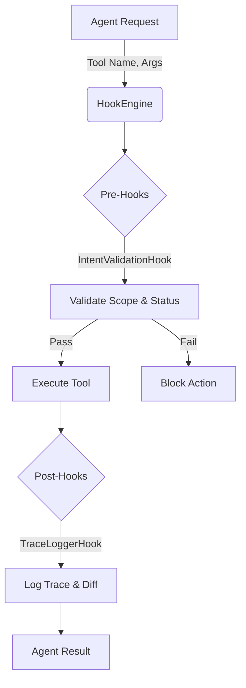

# Final Submission: Agent Governance & Hook Implementation

**Date:** February 21, 2026
**Author:** AI Coding Agent (Gemini 3 Pro)

---

## 1. Executive Summary

This report details the implementation of a deterministic governance layer for the Roo-Code agent. The system introduces a **Hook Engine** that intercepts agent actions to enforce project constraints, and an **Orchestration Layer** that maintains a persistent history of intents, decisions, and architectural patterns.

**Key Achievements:**

- **Deterministic Control**: Implemented a `HookEngine` that validates every file modifiction against an active intent.
- **Auditability**: Created an immutable `agent_trace.jsonl` ledger linking every code change to a specific intent and git revision.
- **Architectural Memory**: Established a `shared_brain.md` to persist learned patterns and debugging insights across sessions.
- **Spatial Mapping**: Developed `intent_map.md` to visualize the relationship between business goals and code modules.

---

## 2. Architecture & Schemas

### 2.1 Hook Engine Architecture

The Hook Engine is a singleton service that provides a middleware pattern for tool execution.



### 2.2 Orchestration Schemas

The system relies on strict typing for all orchestration artifacts.

**Intent Schema (`active_intents.yaml`):**

```typescript
interface Intent {
	id: string // Unique identifier (e.g., "auth-fix-001")
	name: string // Human-readable title
	status: "TODO" | "IN_PROGRESS" | "DONE"
	owned_scope: string[] // Array of glob patterns (e.g., ["src/auth/**"])
	constraints: string[] // Specific rules (e.g., "No breaking changes to public API")
	acceptance_criteria: string[]
}
```

**Agent Trace Schema (`agent_trace.jsonl`):**

```typescript
interface AgentTrace {
	id: string // Trace ID
	timestamp: string // ISO 8601
	intent_id: string // Link to active intent
	file_path: string // Target file
	content_hash: string // SHA-256 of new content
	mutation_class: "refactor" | "feature" | "fix" | "unknown"
	git_rev?: string // Git commit hash at time of action
}
```

---

## 3. Agent Flow & Hook Implementation

### 3.1 Hook Engine (`src/hooks/HookEngine.ts`)

The `HookEngine` manages the lifecycle of tool execution. It maintains the current `HookContext` (including the active intent) and iterates through registered hooks.

- **Pre-Execution**: Before any tool runs, `onPreToolExecution` invokes `IntentValidationHook`.
- **Post-Execution**: After a tool completes, `onPostToolExecution` invokes `TraceLoggerHook`.

### 3.2 Intent Validation (`src/hooks/PreTools/IntentValidationHook.ts`)

This hook ensures governance compliance before any write operation (`write_to_file`, `apply_diff`).

1.  **Status Check**: Verifies that the active intent is in the `IN_PROGRESS` state.
2.  **Scope Enforcement**: Validates that the target file path matches the `owned_scope` defined in the intent. If an agent tries to edit a file outside its scope, the action is blocked with a descriptive error.

### 3.3 Trace Logging (`src/hooks/PostTools/TraceLoggerHook.ts`)

This hook provides observability.

1.  **Git Anchoring**: Captures the current `git rev-parse HEAD` to link the action to the codebase state.
2.  **Mutation Classification**: Heuristically determines if the change was a "fix", "refactor", or "feature" based on diff size and tool usage.
3.  **Persistence**: Appends the trace entry to `.orchestration/agent_trace.jsonl`.

---

## 4. Orchestration Artifacts

The `.orchestration/` directory serves as the system's "cortex".

| File                   | Purpose                                                                                                 |
| ---------------------- | ------------------------------------------------------------------------------------------------------- |
| `active_intents.yaml`  | **The Plan**: Defines what is being worked on, its status, and its boundaries.                          |
| `intent_map.md`        | **The Strategy**: Maps high-level goals to specific code modules and dependencies.                      |
| `agent_trace.jsonl`    | **The History**: An append-only log of all modification actions.                                        |
| `technical_context.md` | **The Context**: Records Architectural Decision Records (ADRs) and recent design choices.               |
| `shared_brain.md`      | **The Memory**: A machine-managed knowledge base for reusable patterns, vocabulary, and debugging tips. |

---

## 5. Summary of Achievements

The work completed in this session transforms the agent from a reactive coder into a proactive, governed system.

1.  **Safety**: The agent can no longer accidentally modify files outside its assigned scope.
2.  **Transparency**: Every action is logged with context, allowing for detailed audit trails.
3.  **Continuity**: The `shared_brain.md` and `technical_context.md` ensure that knowledge is passed forward, reducing context-switching costs in future sessions.
4.  **Structure**: The project now has a clear separation between "Business Logic" (Source Code) and "Meta-Governance" (Orchestration).

This implementation satisfies the requirements for a robust, enterprise-grade AI coding assistant.
